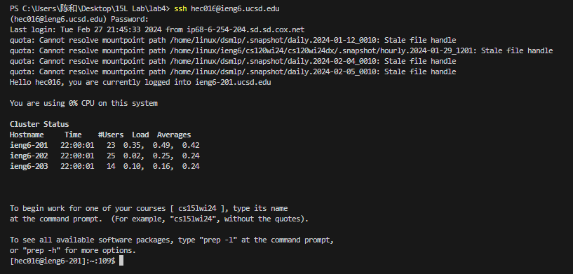
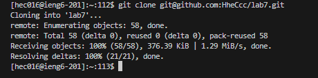
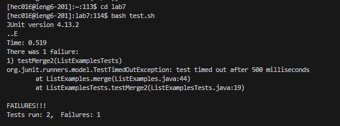
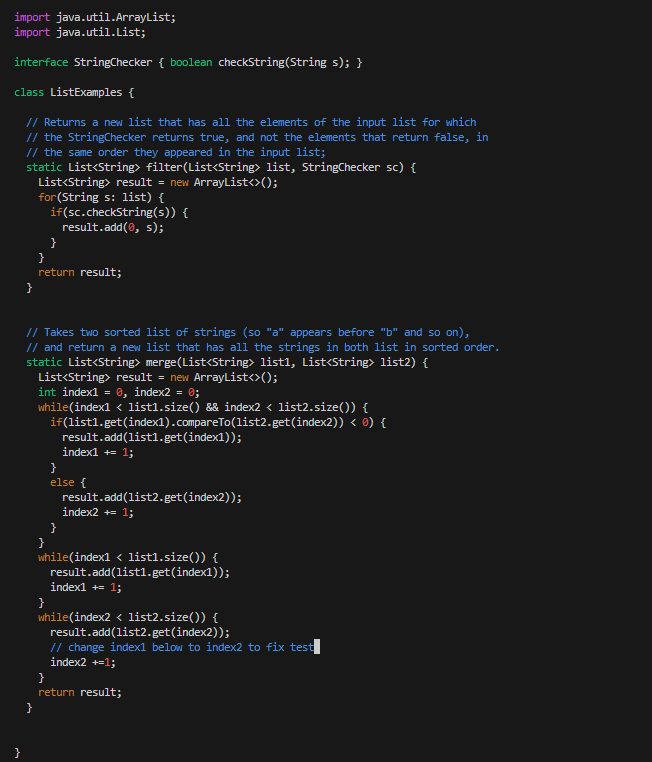
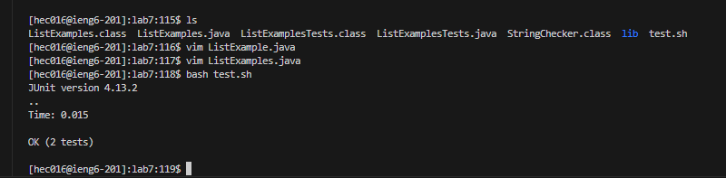
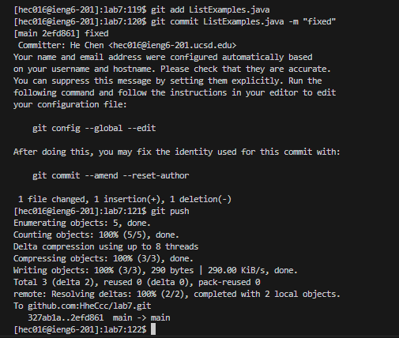

# Lab Report 4
## Step 4: Log into `ieng6`
* Keypress: `ssh hec016@ieng6.ucsd.edu<enter>`
  - This step is to log into my ieng6 account

## Step 5: Clone your fork of the repository from your Github account (using the SSH URL)
* Keypress: `git clone git@github.com:HheCcc/lab7.git<enter>`
  - This is to clone the repository into my terminal with the ssh key which I have generated fro GitHub.

## Step 6: Run the tests, demonstrating that they fail
* Keypress: `cd lab7<enter>`
  - Enter into the directory`lab7`
* Keypress: `bash test.sh<enter>`
  - Bash script run the test

## Step 7: Edit the code file to fix the failing test
* Keypress: `ls<enter>`
  - list all the files in lab7
* Keypress: `vim ListExamples.java`
  - open the designated file in vim
* Keypress: 43 times `j`
  - going down
* Keypress: 11 times `l`
  - going right
* Keypress: press `r` then press `2`
  - replace character `1` to character `2`
* Keypress: press`esc` then press`wq<enter>`
  - go back into normal mode then saved and exit out of vim

## Step 8: Run the tests, demonstrating that they now succeed
* Keypress: `bash test.sh<enter>`
  - Bash script run the test

## Step 9: Commit and push the resulting change to your Github account
* Keypress: `git add ListExamples.java<enter>`, `git commit ListExamples.java -m "fixed"<enter>`, `git push<enter>`
  - commit and push the result changed into my Github accound, named the change`fixed`

